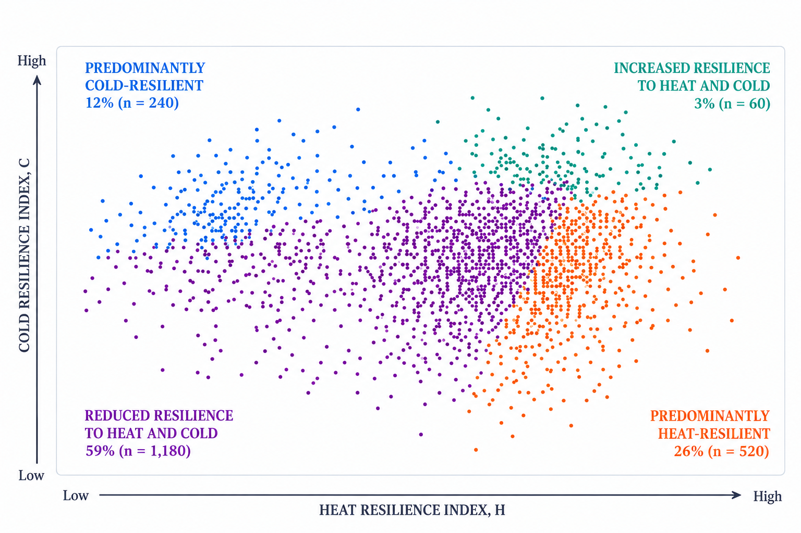
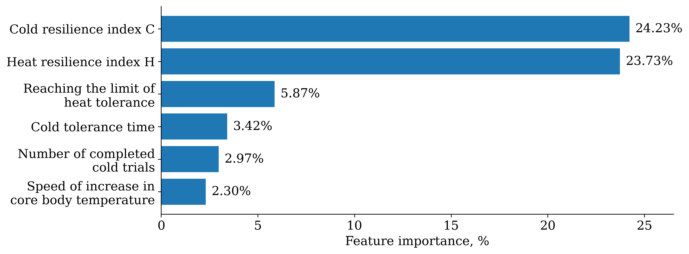

# Multimodal AI for Personalized Assessment of Human Resilience to Extreme Temperature Conditions

An interpretable machine-learning framework for personalized assessment of human resilience to heat and cold as two complementary physiological dimensions.

  

  <em>Personalized temperature-resilience profiles in the two-dimensional heat–cold resilience space.</em>

> Heat resilience and cold resilience are modeled separately rather than collapsed into a single score, allowing asymmetric individual responses to remain visible.

## Research Motivation

People can respond very differently to the same environmental temperature exposure. Individual variation in thermoregulation depends on physiological characteristics, adaptation, fitness, and other personal factors, while resilience to heat does not necessarily imply resilience to cold.

This creates a need for personalized models that move beyond population-average assessment and represent how a specific individual responds across different environmental conditions.

The problem is relevant across contrasting climates. In Arctic environments, workers may face severe outdoor cold together with much warmer industrial settings, including deep mines, metallurgical facilities, compressor and gas-turbine equipment, and ship engine rooms.

In hot-climate regions such as the UAE, prolonged heat exposure coexists with refrigerated facilities and cold-chain logistics that support food storage and food security. These contrasting conditions motivate a framework that represents heat and cold resilience separately within the same individual.

## Research Question

**Can resilience to heat and cold be represented as separate personalized dimensions, and how reliably can the resulting profiles be identified from multimodal individual-level data?**

## Research Approach

The study combines interpretable feature aggregation with machine-learning analysis to construct and evaluate personalized temperature-resilience profiles.

> **2,000 individual profiles → 205 analytical features → 14 physiologically interpretable components → H + C resilience indices → 4 personalized profiles → machine-learning classification and validation**

## Data Representation

The analysis uses a reference dataset of **2,000 individual profiles**, calibrated from distributions and relationships reported in open physiological, population, and experimental data sources.

Each profile is represented by **205 analytical features** covering baseline physiological state, heat and cold response, cardiovascular dynamics, thermoregulation, pain response, recovery, biochemical response, individual characteristics, and environmental conditions.

The feature space is reduced to **14 physiologically interpretable components**:

- **7 heat-response components**
- **7 cold-response components**

After robust standardization and orientation, the components are aggregated into two complementary indices:

- **H — Heat Resilience Index**
- **C — Cold Resilience Index**

## Personalized Profile Model

The two resilience indices form a two-dimensional representation of individual temperature resilience, preserving heat and cold response as separate dimensions.

Four personalized profiles are formed from the combination of H and C:

| Profile | Reference cohort |
| --- | ---: |
| Increased resilience to heat and cold | 60 (3%) |
| Predominantly cold-resilient | 240 (12%) |
| Predominantly heat-resilient | 520 (26%) |
| Reduced resilience to heat and cold | 1,180 (59%) |

## Machine Learning Experiments

To understand how much information is needed for reliable profile classification, three Extra Trees models were compared.

| Model | What the model uses | Accuracy | Balanced accuracy | Macro F1 | Min recall |
| --- | --- | ---: | ---: | ---: | ---: |
| Early-response model | Baseline characteristics and measurements available at the beginning of the heat and cold protocols | 63.65% | 34.62% | 35.26% | 2.08% |
| Full post-protocol model | The complete set of 205 features available after the heat and cold protocols were completed | 95.50% | 92.65% | 93.54% | 86.67% |
| Two-index model (H, C) | Only the final Heat Resilience Index (H) and Cold Resilience Index (C) | **98.45%** | **98.88%** | **97.91%** | **98.14%** |

The early-response model tested whether the final profile could be identified before the full physiological response to heat and cold had been observed. Its performance was substantially lower, indicating that early information alone was not sufficient for reliable classification.

The full post-protocol model used all 205 features available after both temperature protocols and achieved high classification quality.

The two-index model used only H and C and achieved the best overall performance, showing that the two-dimensional heat–cold representation can reproduce the four-profile classification with high accuracy.

## Feature Importance

In the full post-protocol Extra Trees model, the two resilience indices were the most informative features. Together, H and C accounted for approximately **48% of total feature importance**, substantially more than any individual physiological feature.

  

  <em>Feature importance in the full post-protocol Extra Trees model.</em>

## Application Contexts

The framework is relevant to occupational environments where resilience to high temperatures, low temperatures, or pronounced temperature contrasts may be important.

### Arctic and Cold-Climate Environments

In Arctic environments, temperature resilience is relevant to outdoor work, mining, metallurgy, energy infrastructure, compressor and gas-turbine facilities, and ship engine rooms. Depending on the occupation, workers may be exposed to extremely low temperatures, high-temperature industrial environments, or strong contrasts between them.

### UAE and Hot-Climate Environments

In the UAE and other hot-climate regions, prolonged exposure to extreme heat is relevant to outdoor and industrial work. At the same time, refrigerated facilities and cold-chain logistics create occupational contexts involving low temperatures and pronounced transitions between hot outdoor conditions and controlled cold environments.

These application contexts illustrate why heat and cold resilience are represented as separate dimensions: the same personalized profile can characterize resilience to heat, resilience to cold, and their combination under contrasting temperature conditions.

## Scientific Article

The research methodology, experiments, results, and discussion are presented in the accompanying scientific article:

**Personalized Assessment of Human Resilience to Heat and Cold Using Machine Learning**

The article describes the construction of the two-dimensional temperature-resilience model, the machine-learning experiments, feature-importance analysis, and potential applications in occupational environments with high, low, and contrasting temperatures.

[Read the full article](article/personalized-heat-cold-resilience.pdf)
