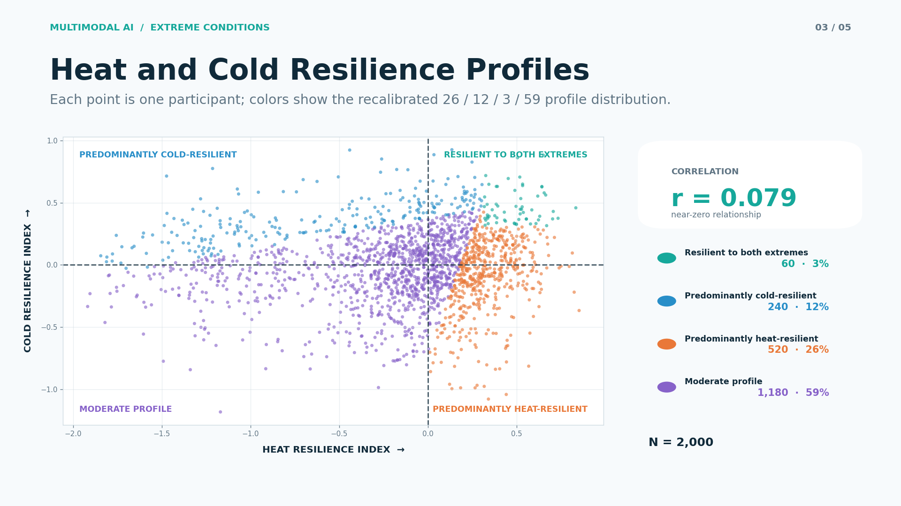

# Multimodal AI for Temperature Resilience Phenotyping

## Overview

This project develops an interpretable four-profile classifier for human
physiological response to heat and cold exposure. It combines protocol-level
measurements with cardiovascular and thermoregulatory markers to summarize how
an individual responded after both temperature challenges.

The model does **not** diagnose a medical condition. It is a research tool for
describing response phenotypes and for supporting the design of future
prospective studies.

<p align="center">
  
</p>

<p align="center">
  <em>Reference-cohort distribution of heat and cold resilience indices.</em>
</p>

## Task

- **Input:** post-protocol heat and cold response measurements for one participant
- **Output:** one of four physiological response profiles
- **Task type:** transparent rule-based phenotyping with model-based validation

## Response Profiles

| Profile | Reference cohort | Plain-language interpretation |
| --- | ---: | --- |
| Predominantly heat-resilient | 520 (26%) | Stronger heat response relative to the reference cohort |
| Predominantly cold-resilient | 240 (12%) | Stronger cold response relative to the reference cohort |
| Resilient to both extremes | 60 (3%) | Strong response across both heat and cold challenges |
| Moderate profile | 1,180 (59%) | Does not meet the calibrated thresholds for the three high-resilience profiles |

The 26/12/3/59 split is a calibration target for this 2,000-participant
reference cohort. It is not an estimate of population prevalence, and new data
are classified with the frozen thresholds rather than rebalanced to these
percentages.

## Physiological Inputs

The operational score uses 14 oriented components: seven from the heat protocol
and seven from the cold protocol. Higher values always represent a more
favourable response direction after orientation.

| Protocol | Components |
| --- | --- |
| Heat | protocol completion, heat-tolerance-limit events, final core temperature, rate of core-temperature rise, heart-rate rise, minimum heart-rate variability (HRV), HRV recovery |
| Cold | cold tolerance, pain intensity, autonomic response, minimum HRV across 1/3/6 °C, HRV recovery across 1/3/6 °C, early withdrawal, completed cold protocols |

Each component is standardized against frozen reference medians and scales;
the signed component scores are averaged into separate heat and cold resilience
indices. The exact field names, units, reference values and score directions are
stored in [`four_group_feature_schema.json`](four_group_feature_schema.json).

## Models and Validation

Five-fold out-of-fold validation was used on the reference cohort.

| Model | Features available | Accuracy | Balanced accuracy | Macro F1 | Lowest profile recall |
| --- | --- | ---: | ---: | ---: | ---: |
| Operational classifier | Two post-protocol resilience indices | **98.45%** | **98.88%** | **97.91%** | **98.14%** |
| Full post-protocol classifier | Full post-protocol feature set plus indices | 95.50% | 92.65% | 93.54% | 86.67% |
| Early-response classifier | Baseline and early response features | 63.65% | 34.62% | 35.26% | 2.08% |

The operational classifier is the recommended research implementation after
both protocols have completed. The early-response model is included to document
the negative result: the rare profiles cannot be screened reliably before the
full physiological response has been observed.

## Repository Structure

- `classify_four_groups.py` — command-line inference script
- `models/` — saved operational, full post-protocol and early-response models
- `four_group_feature_schema.json` — frozen input definitions and reference statistics
- `examples/input_template.csv` — header-only input template
- `results/calibration_summary.json` — aggregate cohort distribution and validation metrics
- `materials/` — publication-ready profile map

## Quick Start

```bash
pip install -r requirements.txt
python classify_four_groups.py examples/input_template.csv results/predictions.csv
```

The output includes the heat and cold resilience indices, assigned profile and a
`borderline_review` flag for cases close to a profile threshold.

## Interpretation and Data Notes

- Results characterize responses observed in the defined temperature protocol;
  they should not be read as a diagnosis or as a claim of permanent resilience.
- No row-level physiological records, direct identifiers or raw time-series
  records are released in this repository. Aggregate cohort results and model
  artifacts are provided for reproducibility.
- The operating thresholds are frozen from the current reference cohort. External
  and prospective validation are required before clinical, occupational or other
  high-stakes use.
